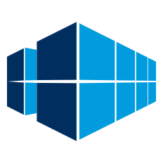

.. SPDX-FileCopyrightText: © 2025 Matt Williams <matt.williams@bristol.ac.uk>
   SPDX-License-Identifier: CC-BY-SA-4.0

:layout: landing

|clifton_logo| Clifton
=======

.. toctree::
   :hidden:
   :maxdepth: 2
   :caption: Contents:

   install
   use
   configure

.. rst-class:: lead

   An SSH certificate and connection manager

Clifton can download your SSH certificates and manage the SSH connection aliases for services which use `Conch`_.

.. grid:: 1 3 3 3
   :gutter: 2
   :padding: 0
   :class-row: surface

   .. grid-item-card:: :octicon:`gift` Install
      :link-type: doc
      :link: install

      Install Clifton to your computer.

   .. grid-item-card:: :octicon:`play` Use
      :link-type: doc
      :link: use

      Use Clifton to connect to remote SSH services.

   .. grid-item-card:: :octicon:`tools` Configure
      :link-type: doc
      :link: configure

      Configure Clifton to work the way you want.

Clifton is free and open source softwre, distributed with the `MIT license`_, and written in Rust for easy deployment.

Used by
-------

.. grid:: 1 1 2 2
   :gutter: 2
   :padding: 0

   .. grid-item-card:: |brics| Bristol Centre for Supercomputing
      :link: https://bristol.ac.uk/research/centres/bristol-supercomputing/

      BriCS uses Clifton for researchers to access its supercomputers.

.. _Conch: https://conch.readthedocs.io
.. _MIT license: https://opensource.org/license/mit
